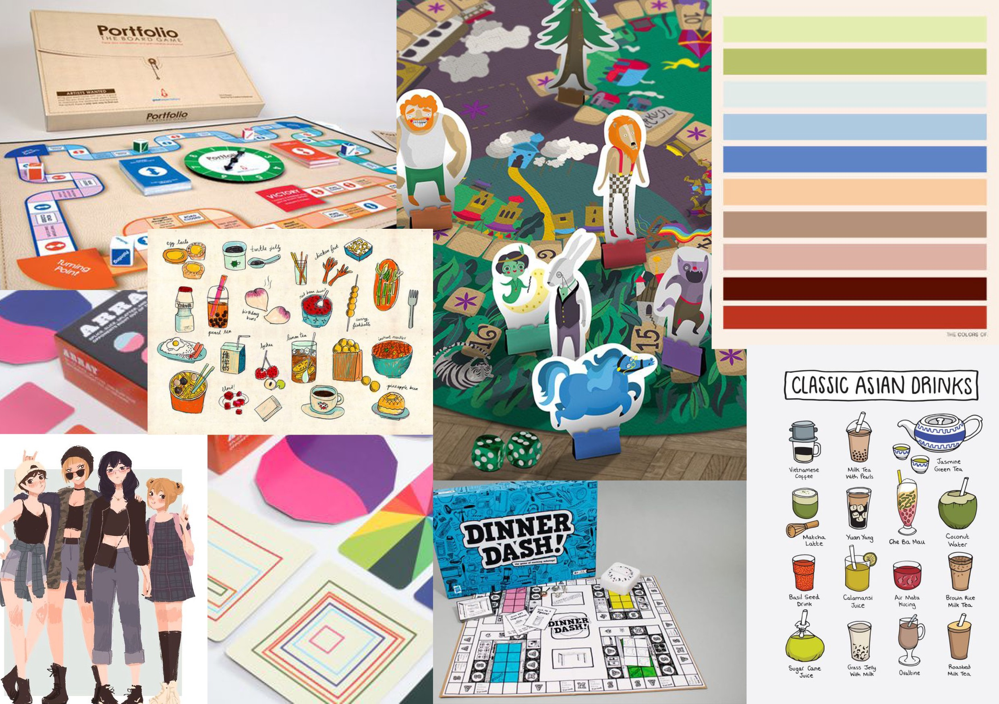
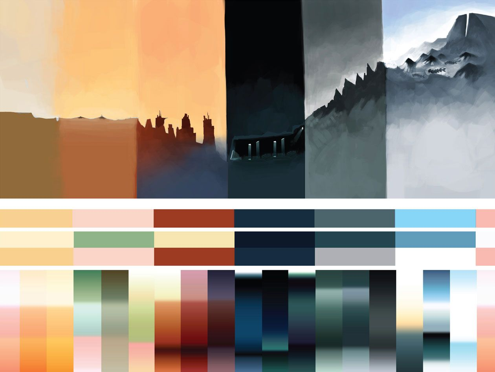
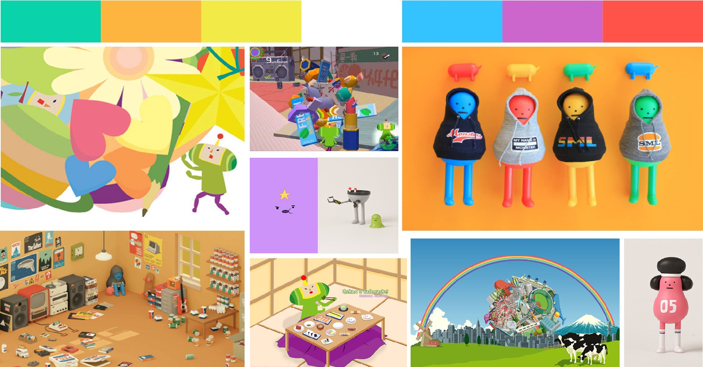
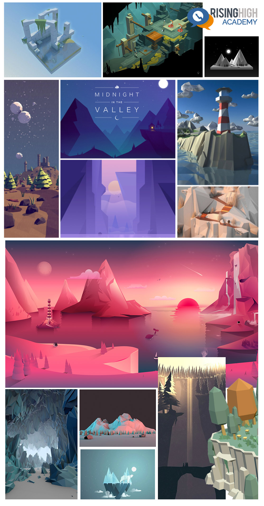

# Mood Board

Today you will build a mood board for the film, show or game that you have chosen for the [Poster Project](../../projects/Layout). You will be using this mood board as a reference guide while you create your Poster.

## References

-   [Art Bibles – What are They?](https://jacobduniam.com/2017/01/03/art-bibles-what-are-they/)
-   [How to create mood boards that inspire: 20 pro tips](https://www.creativebloq.com/graphic-design/mood-boards-812470)
-   [Top 5 Reasons why creating mood boards are an essential starting point for game development](https://risinghighacademy.com/11-2/)

## Examples

-   Example 1
    

-   Example 2
    

-   Example 3
    

-   Example 4
    
