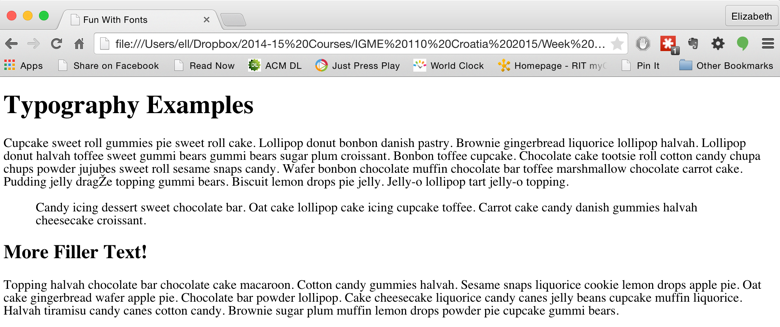
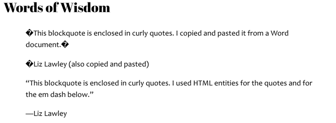

# Typography Exercise 

## Overview & Goals
In today's exercise, you'll use CSS to modify the typography on an HTML page. 

Because I will be out of town on Thursday, you do not need to attend class. However, you must complete this exercise by *noon* on Thursday. 

## Creating Your Work Files
Create a folder called `typography` in your local copy of the igme110 folder. Using Visual Studio (or the text editor of your choice), create a new html 5 file called fonts.html and save it to the typography folder.

Leave the fonts.html file open, and create another new file called fonts.css. 

You should now have two tabs open in your editor. 

# Adding Content to the HTML Page
You need enough text on the page to be able to see the effects of changing aspects of the typography. At a minimum, you should have two different types of headings (e.g. `<h1>` and `<h2>`), two paragraphs of text, and at least one blockquote. Each of the paragraphs and the blockquote should have a full paragraph of text in them. If you don’t feel like writing your own text, you can use a “lorem ipsum” filler text generator; several can be found here: http://www.macobserver.com/tmo/article/10-great-alternative-lorem-ipsum-filler-text-generators. 

You also need to link the fonts.css stylesheet file to your html document, using a link tag in the head of your document: `<link rel="stylesheet" href="fonts.css">`. (In VS Code, you can use Emmet to create the structure of the tag by typing `link:css` and pressing tab.) 

Here's generally what the document ought to look like when you preview it in a browser (although you may have your blockquote in a different location):



# Adding CSS Formatting
After each of the steps below, save your fonts.css file and then reload fonts.html in the browser, so you can see the effect of your changes. 

In your fonts.css file, add a line to change the font family for the h1 elements. Choose a font family that is likely to work across platforms—there’s a list of cross-platform fonts available at http://web.mit.edu/jmorzins/www/fonts.html. The serif font Georgia and the sans-serif font Verdana were designed specifically for web readability, so if you’re not sure what to use, choose one of those. 

As a reminder, in your CSS file, you’d change the font for h1 elements like this, where *fontname* is the font you've chosen:
```css
h1 { font-family: "fontname"; }
```
(The quotes around the font name are only necessary if the font has a space in its name.)

Next choose a font-family for the p tag, and specify that in the CSS file, as well. 

Using the font-size property, change the size of the text in the paragraph tag. CSS properties can be specfied as an absolute value using pixels, points or ems, or as a percentage value. For paragraph text, a value between 12px and 16px probably makes the most sense. As a reminder, you can have multiple CSS declarations for one tag, and you can include line breaks within your definitions, so you could have something like this:

```css
p { 
    font-family: “fontname”; 
    font-size: value; 
    }
```

You can assign styles to more than one HTML tag at a time, by separating the tags with commas. Try assigning the same font attributes to the p and the blockquote tag, like this:
```css
 p, blockquote { 
    font-family: “fontname”; 
    font-size: value; 
    }
```

Using the line-height property, add another line to the definition for p and blockquote, changing the line spacing. I recommend using 150% as the value, but you can play around with different values (using percentage, point, or pixel values) to see how it looks. 

Finally, try changing the width of all the content now, by adding a width property for the body of the document:
```css
     body { width: value; }
```
Try specifying a relative width using a percentage value (70% or 80%), and then view the file and try resizing the browser window. Note what happens. Then change the width specification to a fixed pixel value (600px or 800px) and try the same thing. Leave it set to a fixed width. 

## Using Google Fonts 

Google provides a number of high-quality typefaces available online for anyone to link to in their CSS. Go to http://www.google.com/fonts/ to see what’s available, and browse through the fonts. Then go to https://developers.google.com/fonts/docs/getting_started for instructions on how to incorporate these hosted typefaces into your own pages. 

Identify a typeface you’d like to use for headings on your page (try looking at display fonts). Add the necessary CSS file link to your HTML, and update  your  CSS file to use the selected typeface for your h1 and h2 elements. 


## Using Font Squirrel Fonts
Google has some beautiful typefaces, but some of them are becoming a bit overused (Lobster, for example, is a display face that may be past its prime, and because Roboto ships with the popular web framework Bootstrap, it's also become somewhat predictable.)

In addition to the many typefaces that you can purchase from foundries (or that come with a non-edu license for Adobe CC), you can find many lovely and free fonts at sites like [Font Squirrel](https://www.fontsquirrel.com/). Unlike Google Fonts, Font Squirrel allows you to download a typeface that you can then install and use on your computer. 

In addition to the fonts hosted on (and linked from) Font Squirrel, they provide a [font generator tool](https://www.fontsquirrel.com/tools/webfont-generator) that allows you to upload a typeface from your computer and receive version that you can embed in a web page, so that you don't have to worry about availability on the target audience's computers.

Be careful when embedding fonts, though, to be sure you have the right to do so; some fonts that you might have the right to use on your computer you do not have the legal right to distribute on the web! 

Read the following resources from Font Squirrel before proceeding: 
- [FAQ on Web Font Licensing](https://www.fontsquirrel.com/faq)
- [Help on Installing Fonts](https://www.fontsquirrel.com/help)

Find a body text font that you like on Font Squirrel, and make sure that it's properly licensed for web use. Download it to your computer, and then use the [Webfont Generator](https://www.fontsquirrel.com/tools/webfont-generator) to create the necessary files to add it to a web page. 

## Adding Character Entities 

Add a level 2 heading of "Words of Wisdom" to the end of the document.

Under the heading, add a blockquote enclosing a quote that you particularly. Enclose the text of the quote with opening and closing quotation marks (curly or "smart") quotes using HTML character entities. (There's a list of HTML entities linked from the readings for today )

Below the quote, add the attribution for who said it, preceding the name with a typographic em dash (again, using the appropriate HTML entity). You can use these lists of [HTML Entities](https://www.w3schools.com/html/html_entities.asp) and [HTML Symbols](https://www.w3schools.com/html/html_symbols.asp) from W3Schools for reference.

In the top half of the sample image below, you can see what it looks like if you copy and paste text with smart quotes or other typographic niceties from a Word or PDF document (or even from a web page). In the second part, you can see how it should look if you use HTML entities. Yours should look like the second example, with properly formatted quotes. 



(Note: If your HTML page uses UTF-8 encoding, you may not need to use HTML entities; however, especially when dealing with legacy code, you may be dealing with pages that use older type encoding.)

## Submitting Your Work 
Use an FTP client to upload the typography directory and its contents to the igme110 directory in your www directory on Banjo. We’ll check `http://people.rit.edu/youruserid/igme110/typography/fonts.html` to see if you’ve completed the exercise. Make sure you test that URL to ensure that the files appear properly and can be loaded in a browser! The file must be available at the specified URL by noon on Thursday.
