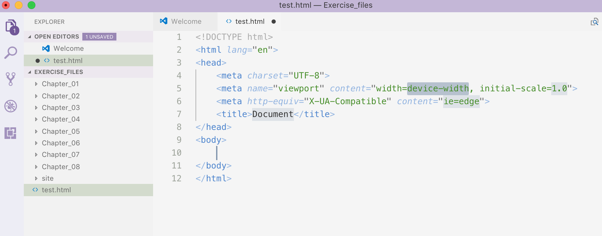

# Using Visual Studio Code with the HTML Essential Training Tutorial

Visual Studio Code (VS Code) is a powerful, free, cross-platform text editor that is optimized for web development. All of the IGM lab computers have VS Code installed, and you can download it for your own Mac or PC from https://code.visualstudio.com/ .

## Retrieving the Exercise Files From Lynda.com
Go to the main page for the Lynda.com tutorial for next week, [HTML Essential Training](https://www.lynda.com/Web-Development-tutorials/HTML-Essential-Training/170427-2.html?org=rit.edu). Click on the tab for "Exercise Files", download `Ex_Files_HTML_EssT.zip` to a local drive, and unzip the archive.

## Using VS Code to Open a Folder
While you can use Visual Studio Code to open and edit a single file, it works best if you start by pointing it to your working folder. Launch the program, and then choose "Open Folder..." from the Welcome page or from the File menu. Select the Exercise_files folder inside the unzipped archive, and choose Open. You should see something like this: 

From here, you'll be able to access and edit any of the files referenced in the HTML Essential Training tutorial. 

## Using VS Code to Create a New HTML File
If you want to create a new file in a folder, you can right-click the folder name and choose "New File". It will prompt you for a new name, and you should give the file a name with either .html or .htm as the file extension so that VS Code knows what syntax highlighting and autocompletion to use. 

Try it now: create a new file in the Exercise_files directory called test.html.  

One nice trick built into VS Code is the utility Emmet, which allows you to add HTML code using shortcuts. By far the most useful of those shortcuts for you right now will be the one that adds a basic HTML document structure for you. 

At the top of your blank document, type `html:5` and then press the tab key. (Do not add any spaces or new lines before pressing tab). Emmet should replace the text you typed with an HTML 5 document structure, like this: 

## Getting Credit for This Exercise
Before leaving class, make sure you show your professor or your TA that you've successfully downloaded the exercise files, opened the folder in VS Code, and created an HTML file. 

## Optional: Live Previewing Your HTML
VS Code does not have the ability to preview your HTML file built in by default. To see how your files look while you're working on the exercises, you will need to save the file to disk, and then use File-->Open in your browser of choice to preview your HTML files. 

However, there is an extension that you can install to enable live previewing in VS Code. Click on the extensions icon in the left pane, and type in `Preview on Web Server` to search for it. Click the Install button, and then the reload button. Now you should be able to type Ctrl-Shift-P to bring up a live preview of your code, or Ctrl-Shift-L to open it in your default browser. 
